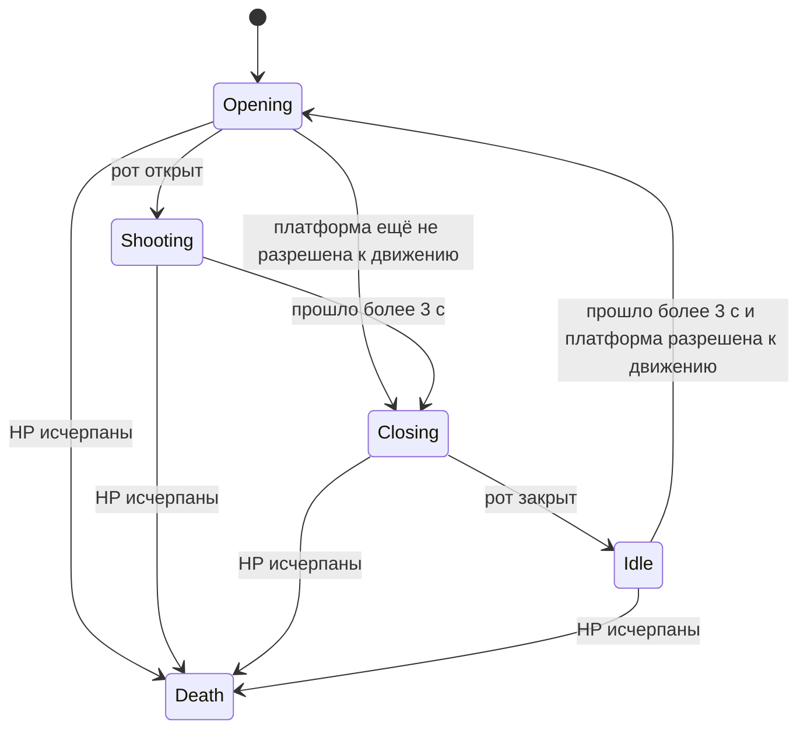

# Босс, сессия и обратная связь

[Оглавление](README.md) · [Механики](01-mechanics.md) · [Баланс](02-balance-and-powerups.md) · [Уровни](03-levels.md) · [Перенос](05-deviations-and-transfer.md)

## Раунд 33 — босс

В кампании после очистки раунда 32 создаётся BossState с оставшимися жизнями; счёт сохраняется в общем HUD. Мяч, платформа и их временные состояния создаются заново. Текущий New Game запускает этот бой напрямую с 5 жизнями. Ни блоков, ни капсул, ни Laser/Catch в BossState нет.

| Параметр | Значение |
| --- | --- |
| HP босса | 16 |
| Урон мяча | 1 за принятый контакт |
| Очки | 1000 за контакт, 16 000 за все HP |
| Центр босса | (112, 104) |
| Видимый спрайт | 62 × 96 |
| Прямоугольник столкновения | 46 × 90; края x = 89…135, y = 59…149 |
| Движение босса | Нет |
| Защищённая фаза | Нет: приём урона не зависит от открытого/закрытого рта |
| Порог мигания | При переходе на 3 HP, далее анимация при HP < 4 |
| Вспышка от попадания | Номинально >0,08 с; иммунитета не даёт |
| Мяч | Новый, nominal speed = 150, ускорений от ударов по боссу нет |

Источники: [создание BossState](../../src/game_states/final_level.cpp#L10), [геометрия босса](../../src/objects/boss.cpp#L3), [повреждение](../../src/objects/boss.cpp#L100), [контакты](../../src/game_states/final_level.cpp#L111).

### Цикл атаки



| Фаза | Номинальный тайминг и действие |
| --- | --- |
| Idle | Таймер копится; после >3 с и `paddle.is_moving` переходит к открытию |
| Opening | Кадр каждые >0,1 с; три шага открытия, около 0,3 с из закрытого положения |
| Shooting | Длится >3 с; выстрел после каждых >0,5 с |
| Closing | Кадр каждые >0,1 с; из полностью открытого положения около 0,4 с до Idle, включая шаг переключения |

`is_moving` здесь означает **разрешение управлять платформой**, а не факт нажатия кнопок. Босс может стрелять, когда игрок стоит на месте, и уже во время трёхсекундного удержания мяча перед стартом.

Число снарядов за фазу зависит от `dt`, строгих сравнений `>` и порядка ветвей. Например, при постоянном шаге 1/120 с — обычно пять; при другой дискретизации возможен шестой до переключения. Не следует задавать «ровно шесть» как подтверждённое правило. Таймер Opening сохраняет остаток между входами, поэтому длительность первого шага следующего открытия может отличаться.

Источники: [Idle](../../src/boss_animation_states/boss_idle.cpp#L11), [Opening](../../src/boss_animation_states/boss_opening.cpp#L12), [Shooting](../../src/boss_animation_states/boss_shooting.cpp#L11), [Closing](../../src/boss_animation_states/boss_closing.cpp#L11).

### Снаряды и уклонение

Снаряд появляется в центре босса. При выстреле определяется направление на **текущее положение платформы**, после чего оно не меняется: самонаведения нет. Столкновение с мячом и стенами не обрабатывается. При y > 256 снаряд удаляется. Анимация меняет размер прямоугольника между примерно 7 × 8 и 8 × 7.

Фактическая формула:

```text
B = центр босса = (112, 104)
P = центр платформы в момент выстрела
velocity = 100 × (P − B) / sqrt(B.x² + B.y²)
```

Нормализуется позиция босса, **а не расстояние до цели**. Поэтому скорость не фиксирована в 100 пикселей/с. При платформе (112,237) вертикальная скорость ≈87,0; при стандартных крайних центрах x = 24 или 200 общая скорость ≈104,3. Вертикальная компонента остаётся ≈87,0, время до высоты центра платформы ≈1,53 с. Первое возможное пересечение прямоугольников происходит немного раньше.

**Интерпретация:** игрок может менять направление после выстрела, но должен одновременно перехватывать мяч. Эта двойная задача заменяет навигацию среди блоков.

Попадание в доступную к управлению платформу удаляет все мячи и уменьшает hp на 1; босс переводится в Closing. Если это произошло во время стартовой последовательности, она сбрасывается. Потеря мяча через низ тоже уменьшает hp. Урон босса после возрождения **не восстанавливается**, существующие снаряды при смерти игрока в общем случае сохраняются. При смерти самого босса снаряды очищаются.

Источники: [направление снаряда](../../src/boss_animation_states/boss_shooting.cpp#L32), [движение](../../src/objects/boss.cpp#L68), [столкновения](../../src/game_states/final_level.cpp#L111).

**Ограничение реализации:** нет немедленной защиты от повторной потери жизни в том же кадре; отключение управления наступает в анимации гибели. Кроме того, список мячей очищается внутри цикла, а затем используется ссылка на удалённый мяч. Надёжность этих ветвей не подтверждена и требует исправления перед переносом.

### Победа

После 16-го попадания запускается анимация смерти: закрытие рта при необходимости, ожидание, последовательность разрушения, затухание. Мячи и снаряды удаляются. После исчезновения босса и ожидания >1 с звучит Outro.

**Перехода на экран победы, в таблицу рекордов или следующий цикл кампании нет.** BossState остаётся активным; игрок может открыть меню и выйти. У Scoreboard есть режим `ALL`, но победа босса его не вызывает. Это незавершённая ветвь игрового цикла.

Источники: [смерть босса](../../src/boss_animation_states/boss_death.cpp#L12), [checkGameState](../../src/game_states/final_level.cpp#L179), [параметр ALL](../../src/game_states/scoreboard.cpp#L3).

## Меню и состояние сессии

| Экран / событие | Поведение |
| --- | --- |
| Первый запуск приложения | Логотип компании около 2,5 с; пункты меню после суммарных 4 с. Enter пропускает заставку |
| New Game | Фактически BossState с 5 жизнями; обычная игра закомментирована |
| Continue Game | Доступен, если json_data[1] не null; загружает обычный GameplayState |
| High Scores | Открывает таблицу поверх меню; возврат закрывает это состояние |
| Exit | Закрывает окно |
| Пауза обычного уровня | Resume, Save and Exit, Exit |
| Пауза босса | Только Resume и Exit |
| Потеря всех жизней | Декоративный экран Insert Coin, credit 0, отсчёт примерно 9 реальных секунд |
| Enter / Space / Esc на экране монеты | Пропуск ожидания; реального continue за монету нет |
| После экрана монеты | При результате строго выше минимального рекорда — ввод имени; иначе Game Over |
| Game Over | 5 игровых секунд и возврат в главное меню; P/Enter/Space ускоряют, Esc закрывает окно |

Источники: [главное меню](../../src/game_states/main_menu.cpp#L99), [выбор](../../src/game_states/main_menu.cpp#L235), [меню паузы](../../src/gameplay_menu.cpp#L11), [экран монеты](../../src/game_states/toss_coin.cpp#L36), [GameOver](../../src/game_states/game_over.cpp#L49).

## Пауза и сохранение

Пауза прекращает обновление объектов и игровых таймеров. HUD и выделение пункта меню продолжают обновляться. Звуки отдельно не останавливаются. В обычной игре обработчик Space не проверяет паузу: он может менять состояние Catch или создавать лазер во время паузы; его движение продолжится после Resume.

Save and Exit становится выбираемым, когда при открытии паузы **хотя бы у одного мяча velocity.y < 0**. Не требуется, чтобы вверх летели все мячи. Условие выражено через навигацию и цвет пункта, но `saveGame()` не проверяет его повторно. Есть случай сохранения выбранного ранее пункта между открытиями паузы; для переноса нужна явная проверка доступности команды.

Сохранение в [data/scoreboard_data.json](../../data/scoreboard_data.json) занимает один слот:

| Сохраняется | Не сохраняется |
| --- | --- |
| hp, счёт, индекс уровня с нуля | Позиция/направление мяча и платформы |
| Минимальная nominal speed среди мячей, с начальным пределом поиска 302,5 | Число мячей, активная капсула, способности, лазеры, Break |
| Позиция, тип и текущие HP каждого оставшегося блока | Точное состояние текущего кадра/анимации |

При загрузке строится оставшаяся раскладка и начинается стартовая последовательность с одним мячом и стандартной платформой. Счётчик выданных пороговых жизней восстанавливается из суммы очков. **Сохранение сразу очищается на диске**, поэтому Continue расходует слот; чтобы продолжить позже ещё раз, нужно снова Save and Exit. Обычный Exit не вызывает сохранение. В боссовом бою сохранения нет.

Граничные ошибки: при загрузке ценность серебра считается по индексу уровня с нуля вместо видимого номера; восстановленное `speed` не пересчитывает velocity; если все мячи имели speed >302,5, сохранится 302,5. Их последствия разобраны в [реестре](05-deviations-and-transfer.md).

Источники: [saveGame](../../src/game_states/gameplay.cpp#L407), [loadSave](../../src/game_states/gameplay.cpp#L435), [сборка сохранённого поля](../../src/level.cpp#L120), [доступность пункта](../../src/gameplay_menu.cpp#L62).

## Рекорды

Локальная таблица содержит до **5 записей**: место, счёт, раунд, имя из трёх символов. Допускаются латинские буквы, цифры и пробел. Enter подтверждает символ, Backspace возвращает к предыдущему. Результат при равенстве последнему рекорду не проходит проверку `score > minimum_score`.

После подтверждения имени результат записывается на диск, сохранение кампании очищается, спустя 5 игровых секунд открывается Game Over. Стандартные записи: **50 000, 45 000, 40 000, 35 000, 30 000**, но рабочий порог определяется текущим файлом, а не постоянной константой. Результат без попадания в таблицу не записывается как рекорд.

Источник: [Scoreboard](../../src/game_states/scoreboard.cpp#L105), [ввод и запись](../../src/game_states/scoreboard.cpp#L201), [минимальный результат](../../src/upper_interface.cpp#L41).

## Визуальная и звуковая обратная связь

| Сигнал | Назначение / поведение |
| --- | --- |
| Цвет блока | Различает очковую ценность; серебро и золото имеют собственную анимацию удара |
| Форма платформы | Показывает Laser / Enlarge, с последовательностью превращения |
| Вращение капсулы | Номинально кадр каждые >0,1 с, восемь кадров |
| Открытие Break | Анимация бокового выхода; право пройти устанавливается сразу, полного открытия ждать не нужно |
| Тени | Мяч и платформа обычно смещены на (+4,+4), падающая капсула — (+2,+2) |
| HUD сверху | Текущий счёт, high score, мигающее 1UP с переключением через 0,5 с |
| Значки внизу | Резерв жизней, hp − 1 |
| Фоны | Четыре фона циклически по обычным раундам, отдельный пятый для босса |
| Звук платформы/цветного блока/металла | Различимые контакты; серебро и золото используют один металлический звук |
| Звуки смерти, Player/пороговой жизни, Enlarge, Laser | Сигналы события |
| Start, Boss Start, Game Over, Outro | Сигналы этапов сессии |

В обычной игре каждый из трёх звуков контакта ограничен одним запуском на 0,05 реальной секунды. У босса такого ограничения для контактов нет. Для перечисленных подключённых звуков/музыки устанавливается громкость 25. Босс мигает на малом HP, но отдельная полоска здоровья не рисуется.

Наличие файлов Enemies, Sky, Ship, Intro и других ресурсов само по себе не означает реализованной механики или катсцены. README автора сообщает об отсутствии обычных врагов и полноценных intro/outro катсцен; стартовый логотип и послебоевая анимация/музыка при этом есть.

Источники: [фоны](../../src/level.cpp#L36), [звуки обычной игры](../../src/game_states/gameplay.cpp#L31), [ограничение контактов](../../src/game_states/gameplay.cpp#L196), [HUD](../../src/upper_interface.cpp#L108), [анимация формы](../../src/paddle_animation_states/paddle_transformation.cpp#L48), [README](../../README.md).
