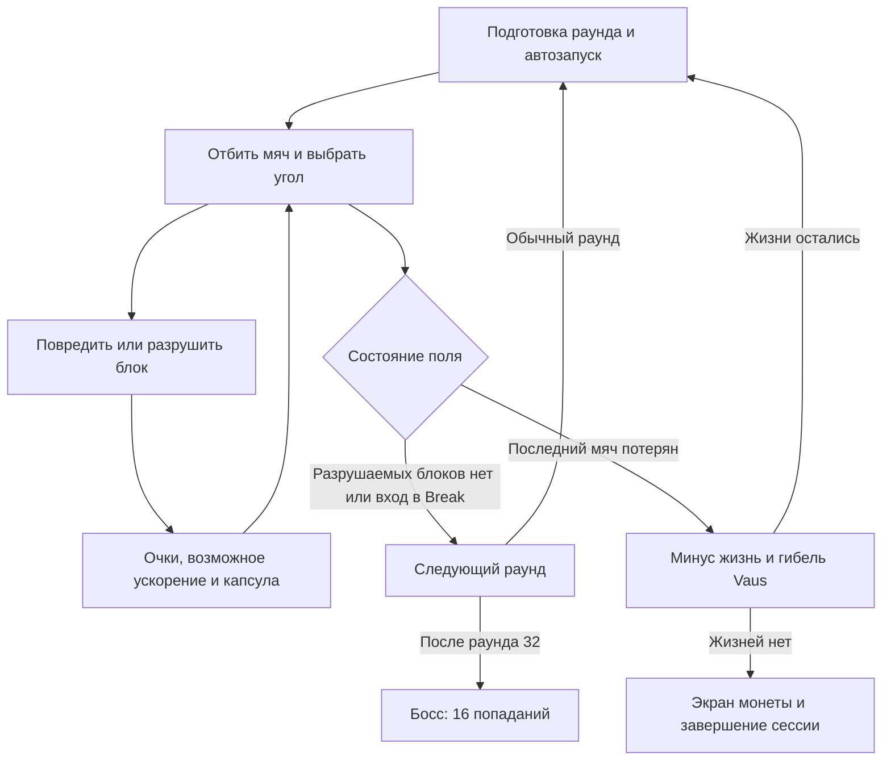

# Arkanoid — геймдизайн по исходному коду

Дата анализа: **11 октября 2026 года**. Объект: исходники в `src/` этого проекта. Документы описывают реализацию, её баланс и пригодные для переноса решения.

## Навигация

| Документ | Содержание |
| --- | --- |
| [Механики](01-mechanics.md) | Поле, управление, платформа, мяч, столкновения, блоки, прохождение и потеря жизни |
| [Баланс и бонусы](02-balance-and-powerups.md) | Числа, вероятности, семь бонусов, очки, дополнительные жизни, расчёт темпа |
| [Каталог уровней](03-levels.md) | Все 32 раскладки, состав, минимальные попадания, базовый счёт, особенности геометрии |
| [Босс и игровой цикл](04-boss-and-session.md) | Раунд 33, атаки, меню, пауза, сохранения, рекорды, звук и визуальная обратная связь |
| [Расхождения и перенос](05-deviations-and-transfer.md) | Сопоставление со StrategyWiki, ошибки кода, рекомендуемые правила для нового проекта |
| [Источники и метод](06-sources.md) | Ссылки на методы исходников, границы достоверности и проверки |

Для первого чтения: механики → баланс → каталог уровней. Для реализации в другом проекте: дополнительно прочитать раздел о переносе; он отделяет полезные правила от ошибок исходника.

## Статус реализации

**Это близкий по содержанию клон, но текущий исходник нельзя считать точным воспроизведением оригинального Arkanoid.**

В коде есть 32 обычных раунда и босс. Однако действующий пункт **New Game запускает сразу BossState с 5 жизнями**; запуск обычной кампании закомментирован. Конструктор обычной игры задаёт **2 жизни**, включая текущую. Вражеских объектов на обычных уровнях нет. Полноценное завершение кампании после победы над боссом не подключено. Кроме того, некоторые неинициализированные поля и обращения к удалённым объектам делают отдельные ветви недостоверными без исправлений. См. [реестр расхождений](05-deviations-and-transfer.md).

Источники: [выбор New Game](../../src/game_states/main_menu.cpp#L235), [начальные жизни](../../src/game_states/gameplay.cpp#L4), [README автора](../../README.md).

## Концепция и основной цикл

Однопользовательская аркада на реакцию и управление траекторией. Игрок перемещает Vaus по горизонтали, удерживает мяч в поле и уничтожает все разрушаемые блоки. Золотые блоки остаются препятствиями. Падающие капсулы меняют возможности игрока; финальный раунд заменяет блоки боссом.

Это схема обычной кампании, реализованной в игровых состояниях; текущий New Game начинает с узла босса. Фактические ограничения ветвей описаны в [механиках](01-mechanics.md) и [боссе](04-boss-and-session.md).

## Что создаёт игровой интерес

Следующие пункты — **дизайнерская интерпретация кода**, а не заявления автора:

- **Прицеливание через отражение.** Место контакта с платформой выбирает один из трёх углов; игрок управляет направлением атаки через позиционирование.
- **Риск при сборе награды.** За падающей капсулой нужно двигаться, одновременно сохраняя возможность отбить мяч.
- **Геометрия важнее количества целей.** Золото и узкие проходы могут сделать уровень с семью целями сложнее уровня с десятками цветных блоков.
- **Чередование режимов.** Серебро увеличивает число попаданий; Laser уменьшает зависимость от траектории; Disruption добавляет запас мячей ценой отсутствия новых капсул.
- **Локальный рост давления.** Скорость растёт от разрушений мячом, а при новом раунде и после смерти сбрасывается. Это преимущественно эскалация внутри попытки, а не непрерывное ускорение кампании.

## Обозначения достоверности

**Факт** — прямо следует из исполняемой ветви исходника. **Расчёт** — выведен из констант и раскладок с указанными допущениями. **Интерпретация** — объясняет возможную роль правила в дизайне. **Рекомендация** — предложенное правило для нового проекта, отсутствующее либо не гарантированное в этом клоне.

Числа даны в логических пикселях и секундах игрового времени. Разрешение окна не меняет логические размеры. Игру и готовый `Arkanoid.exe` при анализе не запускали; соответствие бинарника текущим исходникам не установлено.
